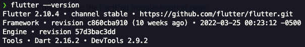

# Flutter Foodies


### Environment

With multi env setup you just can edit file inside ***assets/env*** folder

```
//example .env.development
IS_PRODUCTION=0
BASE_URL=https://masak-apa.tomorisakura.vercel.app/api/
```

### Getting Started

```shell
git clone https://github.com/yodeput/flutter-getx-foodies.git

flutter pub get

// run development env
flutter build apk --flavor development -t lib/main_development.dart

// run staging env
flutter build apk --flavor staging -t lib/main_staging.dart

// run production env
flutter build apk --flavor production -t lib/main_production.dart
```

if you use [derry](https://pub.dev/packages/derry), for example you can type this command and for more command yu can see **derry.yaml** file

```shell
//for get packages and run build_runner
derry gen

//for clean project
derry clean
```

### Structure

- ```common``` - Providing shared widgets, routes, style, utils and apis.
- ```gen``` - Auto generated by [flutter_gen_runner](https://pub.dev/packages/flutter_gen_runner).
- ```data``` - API call and Model entity.
- ```pages``` - UI view, controller, binding.
- ```repository``` - Providing the data source for pages controller that require it.

## SDK



### Packages

- [get](https://pub.dev/packages/get) - Open screens/snackbars/dialogs without context, manage states and inject dependencies easily with GetX.
- [get_storage](https://pub.dev/packages/get_storage) - A fast, extra light and synchronous key-value storage written entirely in Dart.
- [dio](https://pub.dev/packages/dio) - A powerful Http client for Dart.
- [dio_cookie_manager](https://pub.dev/packages/dio_cookie_manager) - A cookie manager for Dio, which supports persistent cookies in RAM and file.
- [cookie_jar](https://pub.dev/packages/cookie_jar) - A cookie manager for http requests in Dart.
- [dio_http_formatter](https://pub.dev/packages/dio_http_formatter) - A Dio interceptor for pretty printing the HTTP request/response to be printed in the console for easier debugging.
- [cached_network_image](https://pub.dev/packages/cached_network_image) - Flutter library to load and cache network images.
- [flutter_cache_manager](https://pub.dev/packages/flutter_cache_manager) - Generic cache manager for flutter.
- [share](https://pub.dev/packages/share) - Flutter plugin for sharing content via the platform share UI.
- [package_info_plus](https://pub.dev/packages/package_info_plus) - Flutter plugin for querying information about the application package.
- [shimmer](https://pub.dev/packages/shimmer) - A package provides an easy way to add shimmer effect in Flutter project.
- [cool_alert](https://pub.dev/packages/cool_alert) - A Flutter package to display animated alert.
- [flutter_dotenv](https://pub.dev/packages/flutter_dotenv) - Easily configure any flutter application with global variables using a `.env` file.
- [flutter_svg](https://pub.dev/packages/flutter_svg) - An SVG rendering and widget library for Flutter.
-  [lottie](https://pub.dev/packages/lottie) - Render After Effects animations natively on Flutter.
- [fluttertoast](https://pub.dev/packages/fluttertoast) - Toast Library for Flutter, Easily create toast messages in single line of code
- [flutter_easyloading](https://pub.dev/packages/flutter_easyloading) - A clean and lightweight loading/toast widget for Flutter.
- [pull_to_refresh](https://pub.dev/packages/pull_to_refresh) - a widget provided to the flutter scroll component drop-down refresh and pull up load.
- [build_runner](https://pub.dev/packages/build_runner) - A build system for Dart code generation and modular compilation.
- [flutter_gen_runner](https://pub.dev/packages/flutter_gen_runner) - The Flutter code generator for your assets, fonts, colors, …


## Licence

```
Designed and developed by 2022 yodeput (Yogi Dewansyah Putra)

Licensed under the Apache License, Version 2.0 (the "License");
you may not use this file except in compliance with the License.
You may obtain a copy of the License at

   http://www.apache.org/licenses/LICENSE-2.0

Unless required by applicable law or agreed to in writing, software
distributed under the License is distributed on an "AS IS" BASIS,
WITHOUT WARRANTIES OR CONDITIONS OF ANY KIND, either express or implied.
See the License for the specific language governing permissions and
limitations under the License.
```
